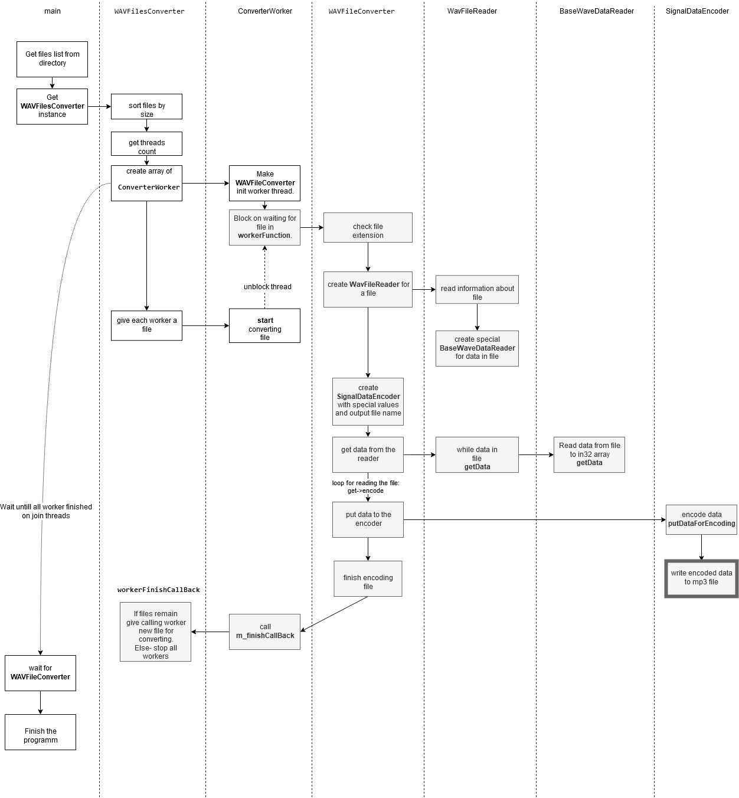

# Brief
This is a project for the task: 
- convert WAV files to MP3 files in multithread manner in OS Linux and Windows.

#

* [**Brief**](#brief)

* [**Description**](#description)

* [**Result**](#result)

* [**Build on Windows**](#build-on-windows)

* [**Build on Linux (Debian like)**](#build-on-linux-debian-like)

* [**How it Works?**](#how-it-works)

# Description
The project contains WAV file parser for data types:
- unsigned integer 8 bit
- signed integer 16 bit
- signed integer 24 bit
- signed integer 32 bit
- float 32 bit
- float 64 bit

*It should work for unsigned 2..7 bit data, and signed 9..31 data, but i have no files to check.*

Converter works for files with format: `RIFF('WAVE' <fmt(PCM|FLOAT)>,<wave-data>)`

To start encoding we should run the program with args like: `wav2mp3 ./directory_with_wav_files`

Program uses pure C++98 standard, so there are no any smartpointers, autos, functional bindings, lambdas and many other useful things. Why? The same reason as it uses POSIX threads instead of C++11.

Error handling uses return values here to keep "warm lamp" aura of code. It could have used exceptions, but it didnt.

I hope I have made not a bad object structure of project. 

# Result
Now the application can read WAV files and convert them to MP3 files using Lame library 3.100 with multy threads. The thread count is an optimal thread count for your system (*threads count == CPU core threads count*) OR if files count is less then cores count-> files count.
It works in Linux and Windows with Cygwin for posix threads. 

The project build system is CMake.

*Build tested on Debian 10, Ubuntu 16.04, Windows 10.*

*App tested with Valgrind -> no memory leaks found.*

*A profiler was used, but the most part of runtime is used by Lame-> so code optimization is unreasonable.*

In the project release section there are built binaries of project for Windows and Linux, but it may not work on every system, and should be rebuilt for a concrete system.

#### Build on Windows:

To build the project on Windows we should install Cygwin from here https://www.cygwin.com/
It allows us to use posix threads under the Windows system. While installing cygwin 3.1.2 in GUI we should enable several additional packages:
`cmake 3.15.5-1`, `gcc-g++ 7.4.0-1`, `gdb 8.1.1-1`, `make 4.2.1-2`

***To build lame using cygwin:***
1. start cygwin terminal
2. choose a place where you want to install binaries `OUR_SETTED_PATH` (ex. `OUR_SETTED_PATH="e:/build_lame"`)
3. go to the lame folder
4. in the lame sources folder start  `configure --prefix=OUR_SETTED_PATH` script to produce make file
5. then run `make` command here
6. and run `make install` to put files to OUR_SETTED_PATH

Our library `libmp3lame.a` is in here `OUR_SETTED_PATH/lib`.

***To build a project:***
1. In the cygwin terminal go to the `src` folder of the project `wav2mp3` (`./wav2mp3/src`)
2. run `cmake CMakeLists.txt` to generate MakeFile
3. run `make` to build the project

***To run the application:***
1. In the cygwin terminal go to the `wav2mp3/build` folder
2. and run `./wav2mp3 ./testfiles`
It will encode test files, which are in the test folder.

If we want to run the project from different places- we should do one of two things:

**1.** put necessary DLLs near our binary file. To get a list of them we should run `ldd wav2mp3/build/wav2mp3.exe` in the cygwin terminal. In my case it returned 
```bash
$ ldd wav2mp3.exe
     ntdll.dll => /cygdrive/c/WINDOWS/SYSTEM32/ntdll.dll (0x7ffc5fae0000)
     KERNEL32.DLL => /cygdrive/c/WINDOWS/System32/KERNEL32.DLL (0x7ffc5df00000)
     KERNELBASE.dll => /cygdrive/c/WINDOWS/System32/KERNELBASE.dll (0x7ffc5ce40000)
     cygwin1.dll => /usr/bin/cygwin1.dll (0x180040000)
     cyggcc_s-seh-1.dll => /usr/bin/cyggcc_s-seh-1.dll (0x3ff430000)
     cygstdc++-6.dll => /usr/bin/cygstdc++-6.dll (0x3fdd80000)
```
so we have to put last three libraries to our build folder. Libraries are in the `your_cygwin_folder/bin` your_cygwin_folder (may be looks like `C:/cygwin64`)


**2.** The second way is to run it separately- to add to your environment variable PATH the path to the libraries `PATH=PATH;your_cygwin_folder\bin` :
* run `cmd` in Windows    
* run  `PATH=PATH;your_cygwin_folder\bin` (your_cygwin_folder is your cygwin folder)
* go to the `wav2mp3.exe` binary
* run it with a directory containing *.wav files.

#### Build on Linux (Debian like):

We should install `build-essential` and `cmake`.

***To build lame:***
1. go to the lame folder
2. choose a place where you want to install binaries `OUR_SETTED_PATH` (ex. `OUR_SETTED_PATH="/home/user/tmp/build_lame"`)
3. in the lame sources folder start  `configure --prefix=OUR_SETTED_PATH --with-pic` script to produce makefile
4. then run `make` command here
5. and run `make install` to put files to OUR_SETTED_PATH

Our library `libmp3lame.a` is in here `OUR_SETTED_PATH/lib`.

***To build a project:***
1. In the terminal go to the `src` folder of the project `wav2mp3` (`./wav2mp3/src`)
2. run `cmake CMakeLists.txt` to generate MakeFile
3. run `make` to build the project

***To run the application:***
1. In the terminal go to the `wav2mp3/build` folder
2. and run `./wav2mp3 ./testfiles`
It will encode test files, which are in the test folder.


# How it Works?

Something like sequence diagram is on the picture:

original diagram is here [diagram](images/main_diagram.drawio) 

#### Notes

./configure --disable-shared --disable-decoder --disable-frontend --enable-static

patches:

https://sourceforge.net/p/lame/bugs/487/
https://sourceforge.net/p/lame/bugs/451/

