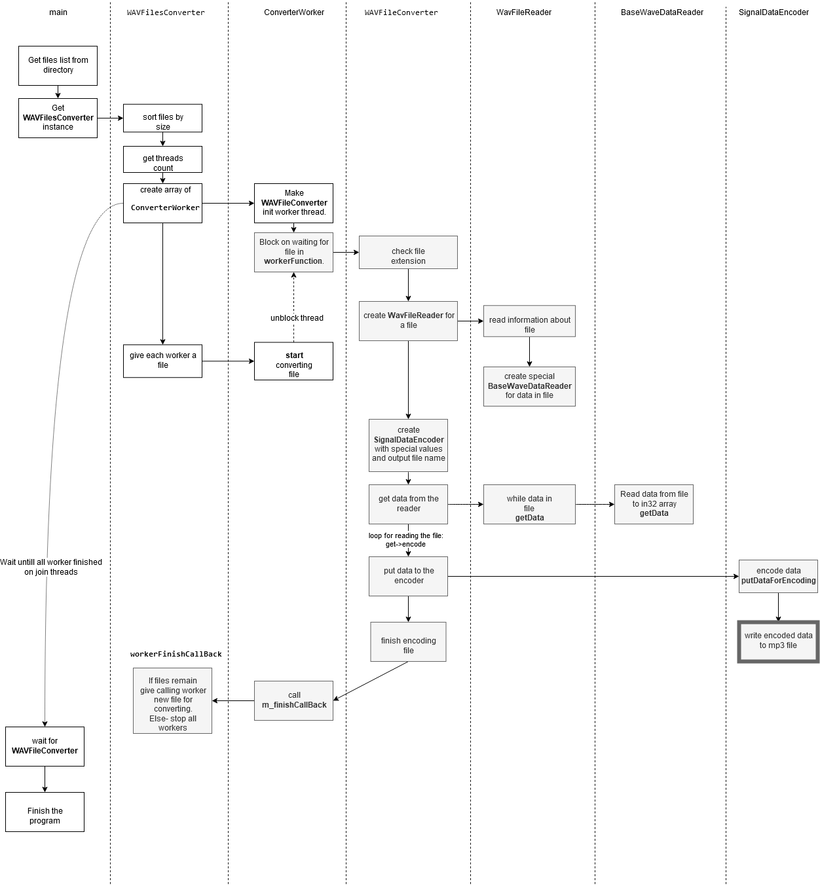

# Brief
This is a project for the task: 
- convert WAV files to MP3 files in multithread manner in OS Linux and Windows.

#

* [**Brief**](#brief)

* [**Description**](#description)

* [**Result**](#result)

* [**Build on Windows with CygWin**](#build-on-windows-with-cygwin)

* [**Build on Windows with MinGW64**](#build-on-windows-with-mingw64)

* [**Build on Linux (Debian like)**](#build-on-linux-debian-like)

* [**How it Works?**](#how-it-works)

# Description
The project contains WAV file parser for data types:
- unsigned integer 8 bit
- signed integer 12 bit
- signed integer 16 bit
- signed integer 24 bit
- signed integer 32 bit
- float 32 bit
- float 64 bit

*It should work for unsigned 2..7 bit data, and signed 9..31 data too.*

Converter works for files with mono/stereo format: `RIFF('WAVE' <fmt(PCM|FLOAT)>,...,<wave-data>)`

To start encoding we should run the program with args like: `wav2mp3 ./directory_with_wav_files`

Program uses pure C++98 standard, so there are no any smartpointers, autos, functional bindings, lambdas and many other useful things. Why? The same reason as it uses POSIX threads instead of C++11.

Error handling uses return values here to keep "warm lamp" aura of code. It could have used exceptions, but it didnt.

I hope I have made not a bad object structure of project. 

# Result
Now the application can read WAV files and convert them to MP3 files using Lame library 3.100 with multy threads. The thread count is an optimal thread count for your system (*threads count == CPU core threads count*) OR if files count is less then cores count-> files count.
It works in Linux and Windows with Cygwin and MinGW for posix threads. 

The project build system is CMake.

*Build tested on Debian 10, Ubuntu 16.04, Windows 10.*

*App tested with Valgrind -> no memory leaks found.*

*A profiler was used, but the most part of runtime is used by Lame-> so code optimization is unreasonable.*

In the project release section there are built binaries of project for Windows and Linux, but it may not work on every system, and should be rebuilt for a concrete system. Attached binaries are built with static linking, so they should work well without any additional stuff. But the cygwin build needs `cygwin1.dll`.

In `./testfiles` directory are some files for tests.

#### Build on Windows with CygWin:

To build the project on Windows we should install Cygwin from here https://www.cygwin.com/
It allows us to use posix threads under the Windows system. While installing cygwin in GUI we should enable several additional packages:
`cmake`, `gcc-g++`, `gdb`, `make`

***To build lame using cygwin:***
1. start cygwin terminal
2. go to the lame folder
3. in the lame sources folder start  `./configure --disable-shared --disable-decoder --disable-frontend --enable-static`  script to produce make file
4. then run `make` command here

Our library `libmp3lame.a` is in here `<lame_folder>/libmp3lame/.libs`.

***To build a project:***
1. In the cygwin terminal go to the `src` folder of the project `wav2mp3` (`./wav2mp3/src`)
2. run `cmake CMakeLists.txt` to generate MakeFile
3. run `make` to build the project

***To run the application:***
1. In the cygwin terminal go to the `wav2mp3/build` folder
2. and run `./wav2mp3_cygwin ./testfiles`
It will encode test files, which are in the test folder.

If we want to run the project from different places- we should do one of two things:

**1.** put necessary DLL `cygwin1.dll` near our binary file. Libraries are in the `<your_cygwin_folder>/bin` your_cygwin_folder (may be looks like `C:/cygwin64`)

**2.** The second way is to run it separately- to add to your environment variable PATH the path to the libraries `PATH=PATH;<your_cygwin_folder>\bin` :
* run `cmd` in Windows    
* run  `PATH=PATH;<your_cygwin_folder>\bin`
* go to the `wav2mp3_cygwin.exe` binary
* run it with a directory containing *.wav files `./wav2mp3_cygwin ./<directory_wit_wav_files>`.

#### Build on Windows with MinGW64:

To build the project on Windows with MinGW64 we should install MSYS2 from here http://www.msys2.org/
It allows us to use posix threads under the Windows system. Then we should install additional tools (like gcc, cmake, etc.) with `pacman` utility

***To build lame using mingw64:***
*Pretty the same as building with cygwin.*
1. start msys2 terminal
2. go to the lame folder
3. in the lame sources folder start  `./configure --disable-shared --disable-decoder --disable-frontend --enable-static`  script to produce make file
4. then run `make` command here

Our library `libmp3lame.a` is in here `<lame_folder>/libmp3lame/.libs`.

***To build a project:***
1. In the msys2 terminal go to the `src` folder of the project `wav2mp3` (`./wav2mp3/src`)
2. run `cmake CMakeLists.txt` to generate MakeFile
3. run `make` to build the project

***To run the application:***
1. In the msys2 terminal go to the `wav2mp3/build` folder
2. and run `./wav2mp3_mingw64.exe ./<directory_wit_wav_files>`
It will encode test files, which are in the test folder.

It is possible to run `wav2mp3_mingw64.exe` from common windows console cmd, because it is standalone application that doesn't need special shared libraries.

#### Build on Linux (Debian like):

We should install `build-essential` and `cmake`.

***To build lame:***
1. go to the lame folder
2. in the lame sources folder start  `./configure --disable-shared --disable-decoder --disable-frontend --enable-static` script to produce makefile
3. then run `make` command here
4. and run `make install` to put files to OUR_SETTED_PATH

Our library `libmp3lame.a` is in here `<lame_folder>/libmp3lame/.libs`.

***To build a project:***
1. In the terminal go to the `src` folder of the project `wav2mp3` (`./wav2mp3/src`)
2. run `cmake CMakeLists.txt` to generate MakeFile
3. run `make` to build the project

***To run the application:***
1. In the terminal go to the `wav2mp3/build` folder
2. and run `./wav2mp3_linux ./<directory_wit_wav_files>`
It will encode test files, which are in the test folder.

# How it Works?

Something like sequence diagram is on the picture:

original diagram is here [diagram](images/main_diagram.drawio) 

#### Notes

./configure --disable-shared --disable-decoder --disable-frontend --enable-static

patches:

https://sourceforge.net/p/lame/bugs/487/
https://sourceforge.net/p/lame/bugs/451/

